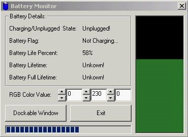



## Battery Monitor

### Description

An easy way to learn how to use the windows api and see how to make simple graphs that map out the percentage of your laptop battery. Email ms2programmer@yahoo.com with your comments, ideas, or bug fixes please, thanks, enjoy.
 
### More Info
 

             |
---                |---
**Submitted On**   |2001-09-15 23:11:56
**By**             |[ms2programmer](https://github.com/Planet-Source-Code/PSCIndex/blob/master/ByAuthor/ms2programmer.md)
**Level**          |Intermediate
**User Rating**    |4.6 (23 globes from 5 users)
**Compatibility**  |VB 4\.0 \(32\-bit\), VB 5\.0, VB 6\.0
**Category**       |[Complete Applications](https://github.com/Planet-Source-Code/PSCIndex/blob/master/ByCategory/complete-applications__1-27.md)
**World**          |[Visual Basic](https://github.com/Planet-Source-Code/PSCIndex/blob/master/ByWorld/visual-basic.md)
**Archive File**   |[Battery Mo265059152001\.zip](https://github.com/Planet-Source-Code/ms2programmer-battery-monitor__1-27281/archive/master.zip)

